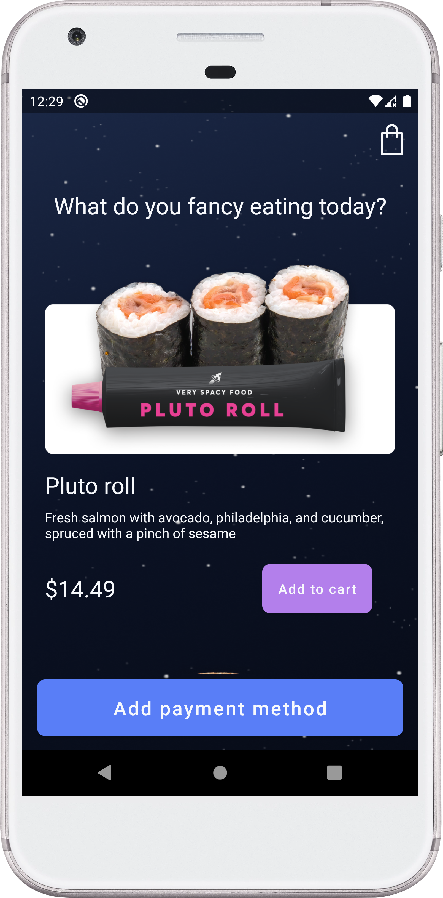
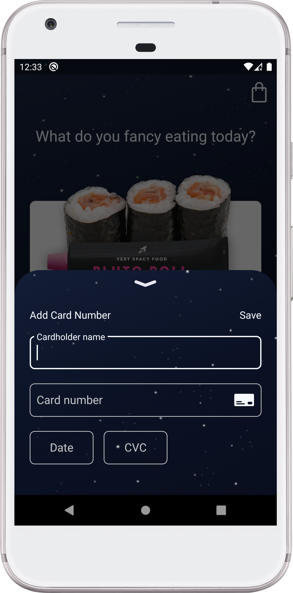
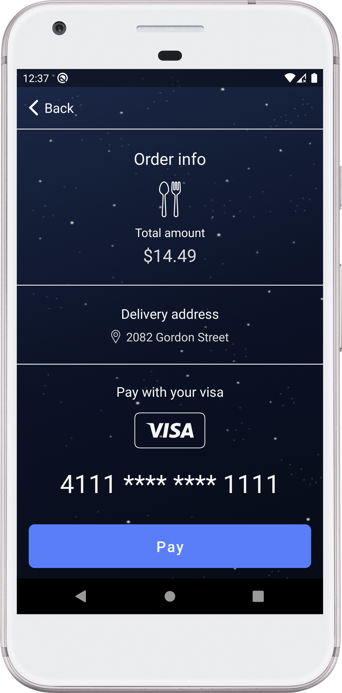
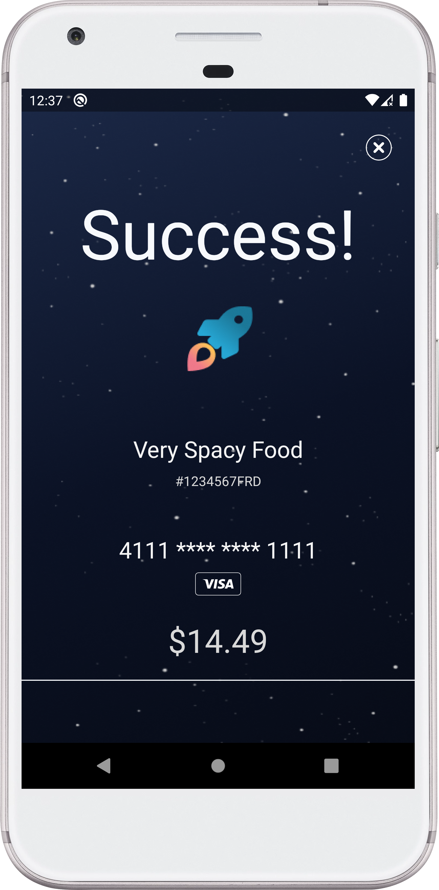

# Very Spacy Food   VGS Collect Android SDK Showcase Application 

Very Spacy Food is a food ordering demo application built with [VGS Collect SDK](https://www.verygoodsecurity.com/docs/vgs-collect/android-sdk/overview) for securely collecting credit card data.

        
        
         
    

## Requirements

- The organization should be registered in <a href="https://dashboard.verygoodsecurity.com/dashboard/">VGS Dashboard</a>;
- <a href="https://developer.android.com/studio">Android Studio</a>;
- Android **4.4** (API level 19) and above.

## How to run it?

### Step 1

Go to your <a href="https://dashboard.verygoodsecurity.com/" target="_blank">VGS organization</a> and establish <a href="https://www.verygoodsecurity.com/docs/getting-started/quick-integration#securing-inbound-connection" target="_blank">Inbound connection</a>. For this demo you can import pre-built route configuration:

-  Find the **configuration.yaml** file inside the app repository and download it.
-  Go to the **Routes** section on the <a href="https://dashboard.verygoodsecurity.com/" target="_blank">Dashboard</a> page and select the **Inbound** tab. 
-  Press **Manage** button at the right corner and select **Import YAML file**.
-  Choose **configuration.yaml** file that you just downloaded and tap on **Save** button to save the route.

Now the data you sent with the VGS Collect SDK will be secured.

### Step 2

Clone Very Spacy Food application repository.

``git@github.com:vgs-samples/very-spacy-food-android.git``

### Step 3

Go to build.gradle and find the code: 
    
    buildConfigField "String", "VAULT_ID", "<VAULT_ID>"
    buildConfigField "String", "BASE_URL", "<VGS_COLLECT_AND_PAY_SERVER_URL>"
    
Replace `"<VAULT_ID>"` with your <a href="https://www.verygoodsecurity.com/docs/terminology/nomenclature#vault" target="_blank">vault id</a>,
`"<VGS_COLLECT_AND_PAY_SERVER_URL>"` with URL to your API for storing redacted payment data collection and revealing this data to a third-party payment services.

Rebuild Project.

### Step 4 

Run the application and try to order some Very Spacy Food. 

#### "Add Credit Card Data" screen

You can use the following test card data to make the order:

- `Joe Business` as a **Cardholder Name**;
- `4111111111111111` as a **Card Number**;
- `11/22` as an **Expiration Date**;
- `123` as a **Card Verification Code (CVC)**;

Press **Save** button. Now data should be submitted to VGS.  
Go to the Logs tab on <a href="http://dashboard.verygoodsecurity.com" target="_blank">Dashboard</a>, find request and secure a payload.  
Instruction for this step you can find <a href="https://www.verygoodsecurity.com/docs/getting-started/quick-integration#securing-inbound-connection" target="_blank">here</a>.

#### "Checkout" screen

Press **Checkout** button. After successful response you may go to your Stripe dashboard and find your order.

### Useful links

- <a href="https://www.verygoodsecurity.com/docs/vgs-collect/android-sdk/overview" target="_blank">Documentation</a> 
- <a href="https://verygoodsecurity.github.io/vgs-collect-android/" target="_blank">VGSCollectSDK API References</a> 
- <a href="https://github.com/verygoodsecurity/vgs-collect-android" target="_blank">VGSCollectSDK GitHub Repo</a> 
